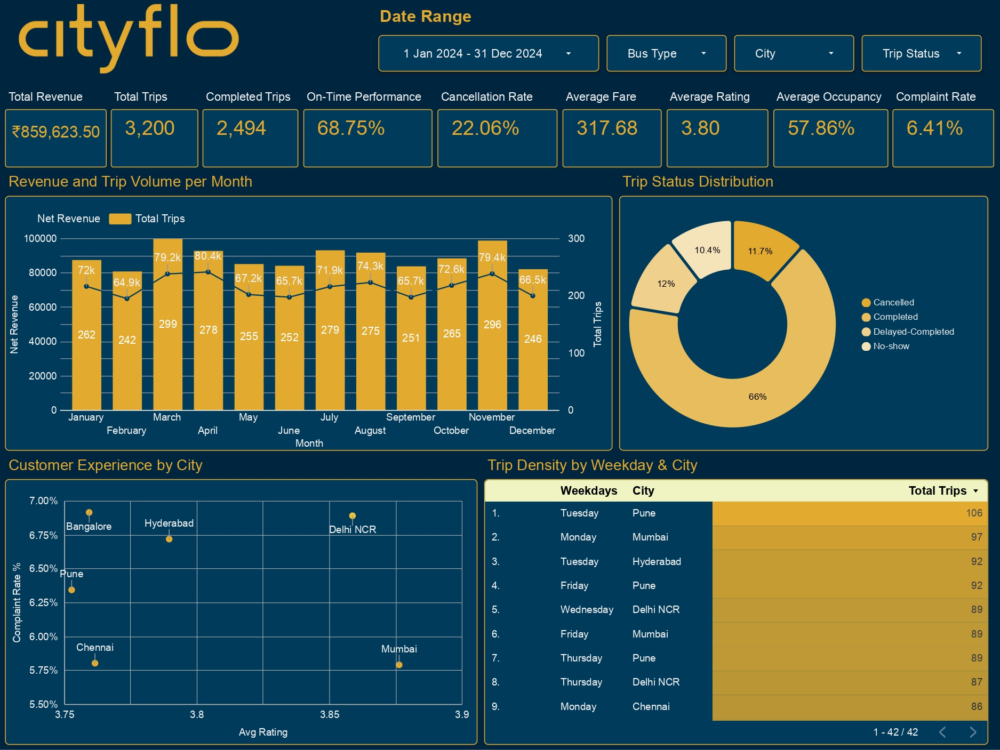
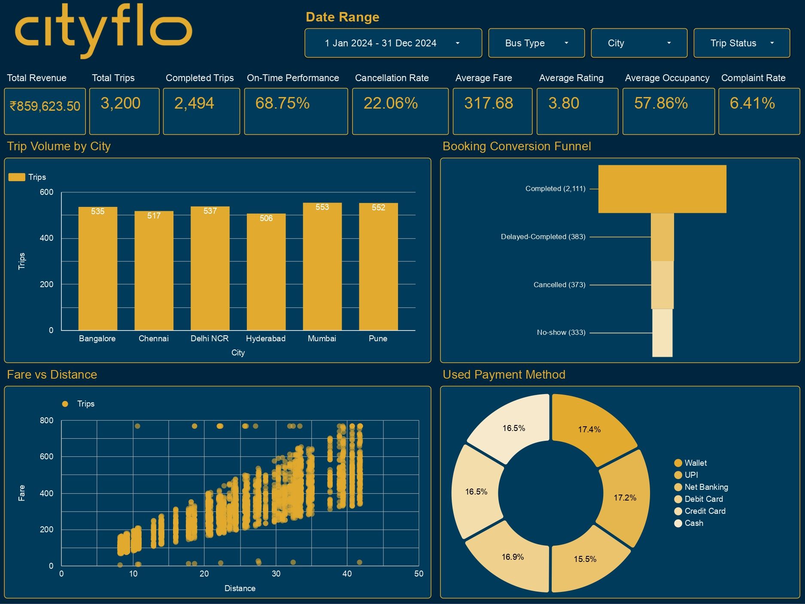
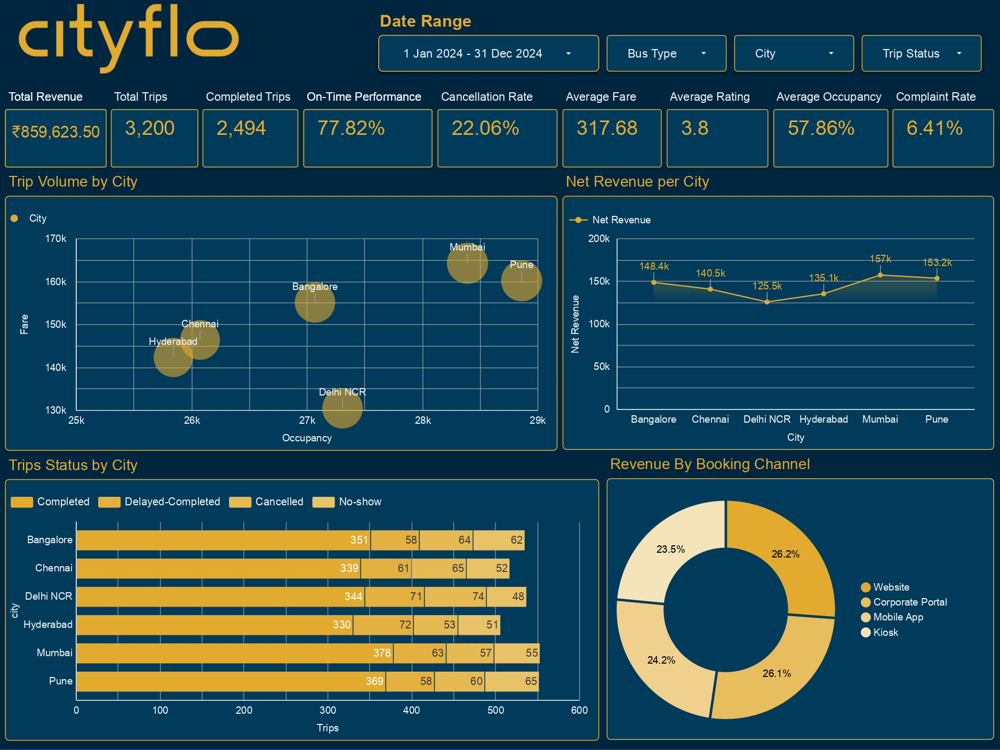
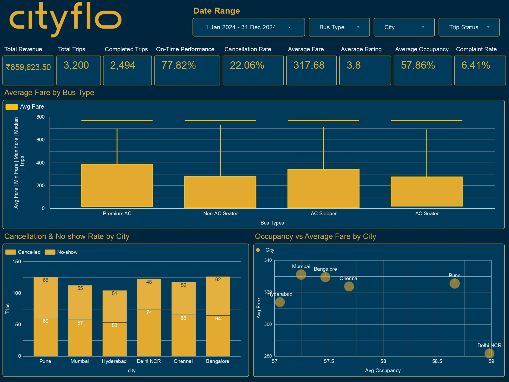

# CityFlo Bus Service --- Metro Cities Analytics & Dashboard Report

## 📊 Project Overview

This project presents an end-to-end **Exploratory Data Analysis (EDA),
data-cleaning, statistical-analysis, KPI-design, and business
dashboarding workflow** for a synthetic CityFlo-style premium bus
service operating across six Indian metropolitan cities.

The project starts with a raw bus-service dataset containing trip,
customer, route, fare, payment, occupancy, operational, and
customer-experience information. The data was inspected, cleaned,
transformed, analyzed statistically, and finally converted into **four
interactive analytical dashboard pages**.

The overall analytical flow is:

> **Raw Data → Data Quality Assessment → Data Cleaning → Feature
> Engineering → EDA → Statistical Testing → KPI Definition → Dashboard
> Design → Business Insights & Recommendations**

------------------------------------------------------------------------

# 🎯 Business Objective

The primary objective is to understand:

-   What factors are associated with **trip delays**?
-   Where are **cancellations and no-shows occurring**?
-   How do **bus types influence fare levels**?
-   How efficiently are buses being utilized through **occupancy**?
-   How do **revenue and trip demand vary across cities and months**?
-   Which cities generate the highest **net revenue**?
-   How does **fare relate to travel distance**?
-   How does **customer experience vary across cities**?
-   Which **payment and booking channels** are being used?
-   Which weekday-city combinations have the highest trip density?
-   Which KPIs should management monitor regularly?

### Core Business Problem Statement

> **What factors drive trip delays, cancellations, and low customer
> satisfaction in CityFlo's metro-city bus operations, and how do
> demand, revenue, and occupancy vary across cities, bus types,
> and time?**

------------------------------------------------------------------------

# 📁 Dataset

## Dataset Link
- **https://www.kaggle.com/datasets/satyakidas07/cityflow-bus-service-metro-cities**

## Raw Dataset

| Attribute | Value |
|---|---:|
| **Raw rows** | 3,258 |
| **Raw columns** | 36 |
| **Duplicate rows identified** | 58 |
| **Final unique trip records** | 3,200 |
| **Cities** | 6 |
| **Routes** | 60 |
| **Bus types** | 4 |
| **Unique customers** | 1,251 |
| **Analysis period** | 2024 |

### Cities Covered

-   Mumbai
-   Pune
-   Bangalore
-   Chennai
-   Hyderabad
-   Delhi NCR

### Main Data Domains

The dataset includes:

-   Trip and customer identifiers
-   Customer demographics
-   City and route
-   Bus type
-   Scheduled and actual trip timings
-   Distance
-   Fare
-   Discount
-   Payment method
-   Booking channel
-   Trip status
-   Cancellation reason
-   Customer rating
-   Occupancy
-   Weather
-   Peak-hour indicator
-   Subscription type
-   GPS availability
-   Complaint status

------------------------------------------------------------------------

# 🔎 Analytical Workflow

The project follows a structured **23-step EDA checklist**.

| Phase | Steps | Purpose |
|---|---:|---|
| **Phase 1 — Inspect** | 1–8 | Understand data structure, types, quality, duplicates, and missing values |
| **Phase 2 — Clean & Prepare** | 9–17 | Standardize, clean, transform, and prepare the data for analysis |
| **Phase 3 — Analyze** | 18–21 | Perform univariate, bivariate, multivariate, and statistical analysis |
| **Phase 4 — Report** | 22–23 | Define KPIs and create dashboard-ready visualizations |


------------------------------------------------------------------------

# 🧹 Data Cleaning & Preparation

The raw dataset contains several intentionally messy or inconsistent
values to simulate real-world data-quality problems.

## 1. Duplicate Records

-   58 duplicate rows were identified.
-   Duplicates were removed using `trip_id`, retaining the first
    occurrence.
-   Final analytical dataset: **3,200 unique trips**.

## 2. Text Standardization

Text fields such as:

-   `customer_name`
-   `gender`
-   `city`

were checked for leading/trailing spaces and inconsistent category
labels.

Gender categories were standardized to consistent values such as:

-   `Male`
-   `Female`
-   `Other`

## 3. Boolean Normalization

Boolean-like fields containing values such as:

-   Yes / No
-   Y / N
-   1 / 0
-   True / False

were standardized into Boolean values.

Relevant fields include:

-   `is_peak_hour`
-   `gps_enabled`
-   `complaint_raised`

## 4. Numeric Cleaning

`fare_inr` contained formatting such as:

-   `₹`
-   `INR`
-   commas
-   text-based numeric values

These were cleaned before conversion to numeric format.

Invalid values were also handled, including:

-   Invalid ages
-   Negative/out-of-range occupancy
-   Non-positive fares
-   Fare outliers

## 5. Missing Values

Important missing-value patterns included:

  Column                  Missing
  --------------------- ---------
  Cancellation reason      77.90%
  Rating                   33.00%
  Actual arrival           22.10%
  Actual departure         11.66%
  Payment mode             11.66%
  Occupancy                11.66%
  Discount                  5.65%
  Age                       1.96%
  Driver name               0.98%

Missing values were handled according to business meaning rather than
blindly replacing every missing value.

For example, a missing rating may be appropriate for cancelled or
no-show trips because those trips do not represent a completed customer
experience.

## 6. Date and Time Processing

`trip_date` was standardized and converted to a datetime field.

Derived fields included:

-   `trip_year`
-   `trip_month`
-   `trip_weekday`

## 7. Derived Operational Metrics

### Delay

``` text
delay_minutes = actual_departure - scheduled_departure
```

A trip was considered delayed when:

``` text
delay_minutes > 5
```

### Net Revenue

``` text
net_revenue_inr = fare_inr - discount_inr
```

### Age Group

Customers were grouped into:

-   18--25
-   26--35
-   36--45
-   46--60
-   60+

------------------------------------------------------------------------

# 📈 Exploratory Data Analysis

## Univariate Analysis

The numerical variables analyzed included:

-   Age
-   Distance
-   Fare
-   Delay minutes
-   Occupancy
-   Net revenue

The analysis used:

-   Histograms
-   Box plots
-   Mean
-   Median
-   Mode
-   Standard deviation
-   Skewness
-   Kurtosis

### Key Descriptive Statistics

  Metric              Mean     Median
  ------------- ---------- ----------
  Age                29.45      29.00
  Distance        24.74 km   25.70 km
  Fare             ₹317.68    ₹311.00
  Delay           5.21 min   0.00 min
  Occupancy         57.86%     57.90%
  Net Revenue      ₹304.08    ₹300.00

The delay distribution is strongly right-skewed because a large number
of trips have little or no delay while a smaller number experience
substantially higher delays.

------------------------------------------------------------------------

# 📊 Bivariate & Multivariate Analysis

The project examined relationships between:

-   Distance and fare
-   Bus type and fare
-   City and rating
-   City and trip status
-   City and fare
-   City and delay
-   Occupancy and fare
-   Peak/non-peak period and delay
-   Customer experience metrics

Visual techniques included:

-   Scatter plots
-   Box plots
-   Grouped comparisons
-   Stacked bar charts
-   Pair plots
-   Correlation analysis
-   City-level comparisons
-   Faceted distributions

------------------------------------------------------------------------

# 🧪 Statistical Testing

## 1. Distance vs Fare --- Pearson Correlation

The Pearson test was attempted between `distance_km` and `fare_inr`.

The notebook output returned:

``` text
Pearson r = nan
p-value = nan
Fail to reject H0
```

The result is not a valid statistical significance result because
missing values were not explicitly removed before running the test.

However, the **Fare vs Distance scatter plot shows a clear positive
visual relationship**: longer trips generally have higher fares.

A corrected statistical implementation should run Pearson correlation
only on rows where both variables are non-null.

------------------------------------------------------------------------

## 2. Peak Hour vs Non-Peak Hour Delay --- Independent t-test

### Results

-   Peak mean delay: **5.4 minutes**
-   Non-peak mean delay: **5.1 minutes**
-   t-statistic: **0.550**
-   p-value: **0.5824**
-   Levene's p-value: **0.6068**

### Interpretation

The null hypothesis is not rejected.

There is insufficient statistical evidence from this test to conclude
that average delay differs between peak and non-peak trips.

------------------------------------------------------------------------

## 3. Fare by Bus Type --- One-Way ANOVA

### Average Fare

  Bus Type          Average Fare
  --------------- --------------
  Non-AC Seater           ₹272.9
  AC Seater               ₹276.0
  AC Sleeper              ₹343.8
  Premium AC              ₹379.3

### ANOVA Results

-   Levene's test p-value: **\< 0.001**
-   F-statistic: **86.53**
-   ANOVA p-value: **1.46 × 10⁻⁵³**

### Interpretation

The analysis indicates a statistically significant difference in average
fare across bus types.

**Premium AC has the highest average fare**, followed by AC Sleeper,
while the two seater categories have lower average fares.

Because Levene's test indicates unequal variances, a variance-robust
method such as Welch ANOVA and appropriate post-hoc comparisons could be
used as a future enhancement.

------------------------------------------------------------------------

## 4. City vs Trip Status --- Chi-Square Test

### Results

-   Chi-square: **12.80**
-   Degrees of freedom: **15**
-   p-value: **0.6181**

### Interpretation

The null hypothesis is not rejected.

The test does not provide sufficient statistical evidence that
trip-status composition is associated with city, even though the
dashboard shows visible differences between cities.

------------------------------------------------------------------------

# 🎯 Core Business KPIs

The dashboards use the following major KPIs:

  KPI                                   Value
  ------------------------- -----------------
  **Total Revenue**           **₹859,623.50**
  **Total Trips**                   **3,200**
  **Completed Trips**               **2,494**
  **On-Time Performance**          **68.75%**
  **Cancellation Rate**            **22.06%**
  **Average Fare**                **₹317.68**
  **Average Rating**             **3.80 / 5**
  **Average Occupancy**            **57.86%**
  **Complaint Rate**                **6.41%**

These KPIs provide a high-level view of:

-   Revenue performance
-   Demand
-   Trip completion
-   Operational reliability
-   Booking leakage
-   Pricing
-   Fleet utilization
-   Customer experience

------------------------------------------------------------------------

# 🖥️ Dashboard 1 --- Operational Overview

## Purpose

The first dashboard provides an **executive-level operational
overview**.



### KPI Cards

The dashboard displays:

-   Total Revenue
-   Total Trips
-   Completed Trips
-   On-Time Performance
-   Cancellation Rate
-   Average Fare
-   Average Rating
-   Average Occupancy
-   Complaint Rate

## Revenue and Trip Volume per Month

| Month | Net Revenue | Trips |
|---|---:|---:|
| **January** | ₹72.0K | 262 |
| **February** | ₹64.9K | 242 |
| **March** | ₹79.2K | 299 |
| **April** | ₹80.4K | 278 |
| **May** | ₹67.2K | 255 |
| **June** | ₹65.7K | 252 |
| **July** | ₹71.9K | 279 |
| **August** | ₹74.3K | 275 |
| **September** | ₹65.7K | 251 |
| **October** | ₹72.6K | 265 |
| **November** | ₹79.4K | 296 |
| **December** | ₹66.5K | 246 |

### Key Observations

-   **April** has the highest monthly net revenue at approximately
    **₹80.4K**.
-   **November** is another strong month at approximately **₹79.4K**.
-   **March** records the highest trip volume at **299 trips**.
-   **February** records the lowest trip volume at **242 trips**.
-   Revenue and trip volume do not always increase together, showing
    that trip count alone does not explain monthly revenue.

## Trip Status Distribution

The donut chart shows the overall distribution of:

-   Completed
-   Delayed-Completed
-   Cancelled
-   No-show


## Customer Experience by City

The scatter chart compares:

-   Average Rating
-   Complaint Rate

This helps identify cities that may require customer-experience
improvement.

Approximate complaint-rate observations shown in the dashboard include:

| City | Complaint Rate |
|---|---:|
| **Bangalore** | 6.9% |
| **Hyderabad** | 6.7% |
| **Delhi NCR** | 6.9% |
| **Pune** | 6.3% |
| **Chennai** | 5.8% |
| **Mumbai** | 5.8% |

Bangalore and Delhi NCR show relatively higher complaint rates in the
displayed analysis, while Mumbai and Chennai are comparatively lower.

## Trip Density by Weekday & City

The table highlights the **highest trip-volume combinations of weekdays
and cities**, helping identify periods of higher demand across different
locations.

| Rank | Weekday | City | Total Trips |
|---:|---|---|---:|
| **1** | Tuesday | Pune | 106 |
| **2** | Monday | Mumbai | 97 |
| **3** | Tuesday | Hyderabad | 92 |
| **4** | Friday | Pune | 92 |
| **5** | Wednesday | Delhi NCR | 89 |
| **6** | Friday | Mumbai | 89 |
| **7** | Thursday | Pune | 89 |
| **8** | Thursday | Delhi NCR | 87 |
| **9** | Monday | Chennai | 86 |


------------------------------------------------------------------------

# 🏙️ Dashboard 2 --- City, Revenue & Operations

## Purpose

The second dashboard provides a detailed view of **city-wise trip
performance, booking conversion, fare patterns, and payment methods**.



## Trip Volume by City

The bar chart compares the **total number of trips across the six
cities**.

| City | Total Trips |
|---|---:|
| **Bangalore** | 535 |
| **Chennai** | 517 |
| **Delhi NCR** | 537 |
| **Hyderabad** | 506 |
| **Mumbai** | 553 |
| **Pune** | 552 |

## Booking Conversion Funnel

The funnel chart represents the distribution of trips across different
booking outcomes.

| Trip Status | Trips |
|---|---:|
| **Completed** | 2,111 |
| **Delayed-Completed** | 383 |
| **Cancelled** | 373 |
| **No-show** | 333 |

The funnel provides a clear view of how trips progress through different
outcomes, from successful completion to cancellations and no-shows.

## Fare vs Distance

The scatter plot shows the relationship between **trip distance and
fare**.

-   **X-axis:** Distance
-   **Y-axis:** Fare
-   **Dimension:** Trips

The visualization helps examine how fare levels change as travel
distance increases and highlights variations and outliers in pricing.

## Used Payment Method

The donut chart shows the distribution of trips by **payment method**.

| Payment Method | Share |
|---|---:|
| **Wallet** | 17.4% |
| **UPI** | 17.2% |
| **Net Banking** | 15.5% |
| **Debit Card** | 16.9% |
| **Credit Card** | 16.5% |
| **Cash** | 16.5% |

The chart provides an overview of the different payment methods used by
customers across the CityFlo service.

------------------------------------------------------------------------

# 🖥️ Dashboard 3 — Revenue, Occupancy & City Performance

## Purpose

The third dashboard provides a detailed view of **city-wise occupancy,
revenue, trip status, and booking-channel performance**.



## KPI Cards

The dashboard displays:

-   Total Revenue
-   Total Trips
-   Completed Trips
-   On-Time Performance
-   Cancellation Rate
-   Average Fare
-   Average Rating
-   Average Occupancy
-   Complaint Rate

## Trip Volume by City

The bubble chart compares **trip volume, occupancy, and fare across
different cities**.

-   **X-axis:** Occupancy
-   **Y-axis:** Fare
-   **Bubble Size:** Trip Volume
-   **Dimension:** City

| City | Occupancy | Fare |
|---|---:|---:|
| Bangalore | ~27.1K | ~₹155K |
| Chennai | ~26.1K | ~₹146K |
| Delhi NCR | ~27.3K | ~₹130K |
| Hyderabad | ~25.9K | ~₹142K |
| Mumbai | ~28.4K | ~₹164K |
| Pune | ~28.9K | ~₹160K |

The visualization allows comparison of **city-level occupancy, fare
levels, and relative trip volume** in a single chart.

## Net Revenue per City

The line chart compares **net revenue generated by each city**.

| City | Net Revenue |
|---|---:|
| Bangalore | ₹148.4K |
| Chennai | ₹140.5K |
| Delhi NCR | ₹125.5K |
| Hyderabad | ₹135.1K |
| Mumbai | ₹157.0K |
| Pune | ₹153.2K |

The chart provides a city-wise comparison of revenue contribution and
helps identify the strongest and lowest-performing revenue markets.

## Trip Status by City

The stacked bar chart shows the distribution of different **trip
statuses across cities**.

| City | Completed | Delayed-Completed | Cancelled | No-show |
|---|---:|---:|---:|---:|
| Bangalore | 351 | 58 | 64 | 62 |
| Chennai | 339 | 61 | 65 | 52 |
| Delhi NCR | 344 | 71 | 74 | 48 |
| Hyderabad | 330 | 72 | 53 | 51 |
| Mumbai | 378 | 63 | 57 | 55 |
| Pune | 369 | 58 | 60 | 65 |

The visualization makes it easier to compare **successful trips,
delayed completions, cancellations, and no-shows** across cities.

## Revenue by Booking Channel

The donut chart shows the distribution of **net revenue across different
booking channels**.

| Booking Channel | Revenue Share |
|---|---:|
| Website | 26.2% |
| Corporate Portal | 26.1% |
| Mobile App | 24.2% |
| Kiosk | 23.5% |

The chart provides an overview of how revenue is distributed across the
different customer booking channels.
------------------------------------------------------------------------

# 🖥️ Dashboard 4 — Pricing, Cancellations & Occupancy

## Purpose

The fourth dashboard focuses on **bus-type pricing, cancellation and
no-show patterns, and city-wise occupancy and fare performance**.



## KPI Cards

The dashboard displays:

-   Total Revenue
-   Total Trips
-   Completed Trips
-   On-Time Performance
-   Cancellation Rate
-   Average Fare
-   Average Rating
-   Average Occupancy
-   Complaint Rate

## Average Fare by Bus Type

The box plot compares **fare levels across different bus types**.

-   **Dimension:** Bus Type
-   **Metric:** Average Fare

| Bus Type | Approx. Average Fare |
|---|---:|
| Premium AC | ₹379.3 |
| AC Sleeper | ₹343.8 |
| AC Seater | ₹276.0 |
| Non-AC Seater | ₹272.9 |

The visualization shows how fare levels vary across different bus
categories and highlights the pricing differences between premium and
standard services.

## Cancellation & No-show Rate by City

The stacked bar chart compares the number of **cancelled and no-show
trips across cities**.

| City | Cancelled | No-show |
|---|---:|---:|
| Pune | 60 | 65 |
| Mumbai | 57 | 55 |
| Hyderabad | 53 | 51 |
| Delhi NCR | 74 | 48 |
| Chennai | 65 | 52 |
| Bangalore | 64 | 62 |

The chart provides a city-wise comparison of cancellations and no-shows,
making it easier to identify locations with higher trip losses.

## Occupancy vs Average Fare by City

The scatter/bubble chart compares **average occupancy and average fare
across cities**.

-   **X-axis:** Average Occupancy
-   **Y-axis:** Average Fare
-   **Dimension:** City

| City | Avg Occupancy | Approx. Avg Fare |
|---|---:|---:|
| Hyderabad | ~57.1% | ₹314 |
| Mumbai | ~57.4% | ₹331 |
| Bangalore | ~57.5% | ₹329 |
| Chennai | ~57.8% | ₹323 |
| Pune | ~58.7% | ₹326 |
| Delhi NCR | ~59.0% | ₹282 |

The visualization helps compare **bus utilization and fare levels**
across cities and understand how occupancy varies alongside average
pricing.

------------------------------------------------------------------------

# 💡 Major Business Insights

## 1. Mumbai is a leading revenue and demand market

Mumbai records:

-   **553 trips**
-   Approximately **₹157K net revenue**

It is the strongest city in the dashboard on both trip volume and net
revenue.

## 2. Pune is also a strong-performing market

Pune records:

-   **552 trips**
-   Approximately **₹153K net revenue**

It is very close to Mumbai in trip volume and revenue contribution.

## 3. Delhi NCR requires closer investigation

Delhi NCR has:

-   The lowest displayed net revenue among the six cities
-   The highest displayed cancellation count
-   The highest displayed occupancy
-   The lowest displayed average fare in the new occupancy-fare scatter
    chart

This combination is particularly important because it suggests that
**high occupancy does not automatically translate into high revenue**.

## 4. Premium bus types have substantially higher fares

Premium AC has an average fare of approximately:

**₹379.3**

compared with:

**₹272.9--₹276.0** for the seater categories.

This demonstrates the importance of bus-type segmentation in pricing and
revenue analysis.

## 5. Cancellation and no-show leakage is material

The overall dashboard KPI shows:

**22.06% cancellation rate**

The city-level dashboard shows that cancellation/no-show activity is not
evenly distributed.

Delhi NCR stands out for cancellations, while Pune stands out for
no-shows.

## 6. Fleet utilization has room for improvement

Overall average occupancy is:

**57.86%**

The city-level occupancy values are relatively close to one another,
suggesting that utilization is fairly consistent across the six cities
but remains below full capacity.

This creates an opportunity for:

-   Demand-based scheduling
-   Route optimization
-   Capacity planning
-   Peak/off-peak allocation
-   Targeted promotions

## 7. Customer experience differs across cities

Overall:

-   Average rating = **3.80 / 5**
-   Complaint rate = **6.41%**

The city-level customer-experience dashboard shows meaningful
differences in complaint rates.

## 8. Monthly demand is uneven

March and November are among the strongest demand months, while February
is the weakest in trip volume.

Monthly revenue also varies, with April being the highest-revenue month
in the displayed dashboard.

## 9. Occupancy and fare should be analyzed together

The fourth dashboard demonstrates the value of combining utilization
with pricing.

A city with high occupancy may still have relatively low revenue if its
average fare is low.

Therefore, a stronger management metric would be:

> **Revenue per available seat / Revenue per trip alongside occupancy**

rather than occupancy alone.

------------------------------------------------------------------------

# 📌 Business Recommendations

## 1. Reduce cancellations and no-shows

Focus investigation on cities with higher booking leakage.

Potential actions include:

-   Automated booking reminders
-   Improved cancellation communication
-   No-show prediction
-   Waitlist management
-   Better customer notifications
-   City-specific cancellation analysis

## 2. Improve on-time performance

The overall on-time performance is:

**68.75%**

Management should investigate delays by:

-   Route
-   City
-   Bus type
-   Peak period
-   Weather
-   Departure time

## 3. Optimize fleet capacity

With average occupancy of:

**57.86%**

there is potential capacity headroom.

Compare occupancy by:

-   City
-   Route
-   Weekday
-   Bus type
-   Peak hour
-   Subscription type

Low-utilization routes may require schedule changes, while consistently
high-utilization routes may justify additional capacity.

## 4. Use differentiated pricing by bus type

Because Premium AC and AC Sleeper have higher fares, pricing strategy
should be segmented by bus category.

Potential analysis:

-   Fare elasticity
-   Occupancy vs fare
-   Revenue per bus
-   Premium-service demand
-   Customer segment by bus type

## 5. Investigate Delhi NCR

Delhi NCR is particularly interesting because the dashboard shows:

-   High occupancy
-   Lower average fare
-   Highest cancellation count
-   Lowest city-level net revenue

This combination should be investigated at the **route level** before
making operational decisions.

## 6. Protect high-performing cities

Mumbai and Pune should be evaluated for:

-   Additional capacity
-   Route expansion
-   Premium service availability
-   Customer retention
-   Revenue optimization

## 7. Target customer-experience improvement

Cities with higher complaint rates should be analyzed for root causes
such as:

-   Delays
-   Route reliability
-   Bus quality
-   Communication
-   Booking experience

------------------------------------------------------------------------

# 🛠️ Tools & Technologies

| Tool / Technology | Purpose |
|---|---|
| **Kaggle** | Dataset sourcing and analysis environment |
| **Python** | Data analysis and preprocessing |
| **Pandas** | Data manipulation and cleaning |
| **NumPy** | Numerical operations |
| **Matplotlib** | Data visualization |
| **Seaborn** | Statistical visualization |
| **SciPy** | Hypothesis testing and statistical analysis |
| **Microsoft Excel** | Cleaned Data handling and validation |
| **Data Studio (Looker Studio)** | Interactive dashboard development |
| **GitHub** | Project documentation and version control |

------------------------------------------------------------------------

# 📂 Suggested Project Structure

``` text
CityFlo-Bus-Service-Data-Exploration/
│
├── Raw Dataset/
│   ├── cityflo_bus_service_metro_cities.csv
│
├── Cleaned Dataset/
│   └── cityflo_bus_service_metro_cities_cleaned.csv
|
├── Data Analysis/
│   └── cityflo-data-analysis.ipynb
│
├── Dashboards/
│   ├── Dashboard_1_Operational_Overview
│   ├── Dashboard_2_City_Booking_Performance
│   ├── Dashboard_3_City_Revenue_Performance
│   └── Dashboard_4_Pricing_Occupancy_Analysis
│   └── CityFlo_Bus_Service_Data_Analysis_Dashboard.pdf
|
├── README.md
└── requirements.txt
```

------------------------------------------------------------------------

# ⚠️ Limitations & Data Quality Notes

1.  The dataset is **synthetic** and does not represent real CityFlo
    operational data.
2.  The raw dataset intentionally contains data-quality issues.
3.  The Pearson correlation test returned `NaN` because missing values
    were not removed before the test. The visual scatter relationship
    should therefore be interpreted separately from that statistical
    output.
4.  The bus-type ANOVA is statistically significant, but Levene's test
    indicates unequal variances. Welch ANOVA and post-hoc analysis would
    strengthen the conclusion.
5.  The city vs trip-status chi-square test is not statistically
    significant.
6.  There is no geographic coordinate data, so a true route map was not
    used.
7.  The analysis covers only 2024, preventing year-over-year comparison.
8.  Correlation and association do not establish causation.

------------------------------------------------------------------------

# 🚀 Future Enhancements

## Predictive Analytics

-   Delay prediction
-   Cancellation prediction
-   No-show prediction
-   Demand forecasting
-   Revenue forecasting
-   Customer churn prediction

## Operations Analytics

-   Route profitability
-   Revenue per kilometer
-   Revenue per seat
-   Revenue per available seat
-   Fleet utilization
-   Driver performance
-   Route-level occupancy

## Customer Analytics

-   Customer lifetime value
-   Repeat-trip behavior
-   Subscription retention
-   Complaint prediction
-   Rating prediction
-   Customer segmentation

## Advanced Statistical Analysis

-   Welch ANOVA
-   Post-hoc pairwise tests
-   Corrected Pearson correlation
-   Regression analysis
-   Logistic regression
-   Time-series forecasting

## Advanced Dashboarding

Potential future dashboard additions:

-   Route-level drill-down
-   Interactive city-to-route analysis
-   Peak-hour heatmaps
-   Revenue-per-seat KPI
-   Delay root-cause analysis
-   Customer segment analysis
-   Predictive demand indicators


------------------------------------------------------------------------

## 📚 Project Reference

**Dataset:** `cityflo_bus_service_metro_cities.csv`\
**Cleaned Dataset:** `cityflo_bus_service_metro_cities_cleaned.csv`\
**Dataset Period:** January 2024 – December 2024 
**Dataset Type:** Synthetic / Educational
**Domain:** Urban Mobility / Bus Transportation\
**Dashboards:** 4\
**Primary Focus:** Operations, Revenue, Pricing, Utilization & Customer
Experience

------------------------------------------------------------------------

## 🏁 Conclusion

This project provides a comprehensive view of CityFlo bus operations across six major metro cities in 2024. The analysis highlights key patterns in **revenue, trip performance, customer experience, pricing, cancellations, and occupancy**, helping identify areas for operational and business improvement.

------------------------------------------------------------------------

## Author
**Pallabi Biswas**  
- Btech CSE
- **Contact:** pallabibiswas4002@gmail.com
---
